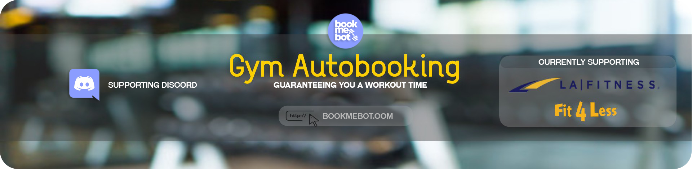

*  *  *  *  *

## Description
🤖 The *Book Me Bot™* gym chatbot allows you to easily view and autobook available times at your local gym, helping you stick to your important workout schedule and stay on track during COVID-19.

😞 Sometimes it feels like there is no end in sight for COVID-19 restrictions. Even after vaccines are administered, government officials believe that the current situation may last for years to come. This means that even when gyms reopen, they will still enforce strict capacity rules and you will be required to book your workout time well in advance.

📅 **PROBLEM:**
We've all been in the same position before - you log into your gym portal, click on the calendar to view available workout times, and see that everything is booked for the next month. How are you supposed to get your pump on these days?

🚀 **SOLUTION:**
Visit **www.bookmebot.com** to book your workout quickly and easily, while also guaranteeing reservation times for your future workouts. Through the Discord app, you can select your gym, specify your workout time range, and let the bot book your time slot ahead of anyone else. You will also receive a reminder about your upcoming workout. Guarantee your gym booking time, EVERY TIME!

**Update: The Book Me Bot™ gym chatbot is currently available on the Discord App and supports Fit4Less and LA Fitness gyms. More platforms and gyms coming soon. Join the [Discord group](https://discord.com/invite/PQzB4mmKMd)**

*  *  *  *  *

# How To Use The Gym Bot 💪 

### Join the Discord public server! (New Feature & Bug Fix Announcements)
Join the [Discord group](https://discord.com/invite/PQzB4mmKMd). You can type your commands and interact with the bot by **direct messaging** it.
*Please do not put your private config in public chats.*

###### *Note*: The bot is currently up and running. **If there are any issues**, please contact us by creating an issue request on GitHub with an attached screenshot.

*  *  *  *  *

## Commands
`!config`
#### Parameters:
- Gym (lafitness/ fit4less)
- Email Address/ Username depending on your gym
- Password
- Exact fit4less location
- Exact fit4less location (Backup)
- Minimum time range to book (24 hour)
- Maximum time range to book (24 hour)

This command sets up the configuration with all of your login details, preferred location, and workout time range in which the bot will book you a time. Book Me Bot™ will find the earliest time slot available within this time range and book it for that day.

If you are not already a user, you can call `!config new` to be added to our list of users with your custom configuration. If you are already a user, calling the same command will update your previous config. *Times are in 24 hour format (##:##) and you can view all locations if you call the `!locations` command*

You can also use `!config -{Field} {Value}` to update a particular field in your configuration. For example, if you want to update your previous email, call `!config -email new@email`. Available fields include: gym, email/username, password, location, locationBackup, begin, end

#### Usage(s):

- `!config` *To get the config - You need to set up your configuration before calling this command*
- `!config new` *To get add/update your entire gym configuration*
- `!config -[FIELD] [VALUE]` *To update a specific field - You need to set up your configuration before calling this command*

`!book` 

This command handles the automated booking process, reserving all the times within the specific time range that you select. For example, if you want to book a time between 11:00 and 17:00 for the "Centerpoint-Mall" location, you can call the `!book` command from the server and gets a private message revealing your private login information with all your booked times. *You need to setup your configuration before calling this command*

`!autobook` 

You can toggle on and off if you want Book Me Bot™ to autobook for you without you having to use the `!book` command every 3 days. *You need to setup your configuration before calling this command*

`!reserved`

Lists all of your booked workout times. *You need to setup your configuration before calling this command*  

`!locations`

Book Me Bot™ replies with a list of available locations. You can copy a location into the [location] field when setting up the config.

`!help`

Lists all Book Me Bot™ commands with short descriptions.

*  *  *  *  *
# Donate 🏋️
Please note that Book Me Bot™ is currently free. If you use Book Me Bot™ to book your workouts, please consider sending the creator a donation :-) Enjoy your stress-free workout and get your pump on! 

To donate, join the public server [here](https://discord.gg/PQzB4mmKMd) and type 'donate' in the donations text chat
